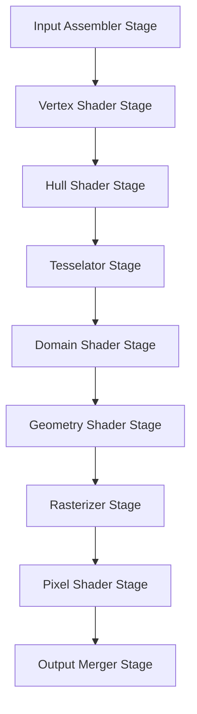

# La pipeline de rendu

[Page d'accueil](README.md)

Sommaire : 
- [Couleurs](#couleurs)

## Couleurs
Les écrans émettent une mixture de lumière rouge, vert et bleu pour chaque pixel. On utilise donc un modèle de couleur RGB (Red, Green, Blue) pour représenter les couleurs. Chaque écran possède une intensité maximale de lumière qu'il peut émettre, il est utile d'utiliser un intervalle normalisé de 0 à 1 pour ces intensités avec 0 représentant l'absence de lumière et 1 représentant l'intensité maximale. En plus du R,G,B on utilise aussi un canal alpha (A) pour représenter la transparence d'une couleur. On a donc la possibilité d'exprimer une couleur avec 128 bits (16 octets), on peut donc utiliser un `XMVECTOR`.

On peut aussi exprimer une couleur avec 32 bits (4 octets), un octet étant donné à chaque composante (R, G, B, A). Attention, ici chaque composante est un entier non signé donc sur l'intervalle [0, 255]. La bibliothèque `DirectX Math` nous fournit une structure `XMCOLOR` dans le namespace `DirectX::PackedVector` qui représente une couleur sur 32 bits. On peut convertir une couleur 32 bits vers une couleur 128 bits et inversement avec les fonctions :
```cpp
XMVECTOR XM_CALLCONV XMLoadColor(const XMCOLOR* pSource);
void XM_CALLCONV XMStoreColor(XMCOLOR* pDestination, FXMVECTOR V);
```

## Vue d'ensemble de la pipeline de rendu
La pipeline de rendu représente la séquence d'étapes nécessaire pour générer l'image 2D basée sur la vue de la caméra. 
